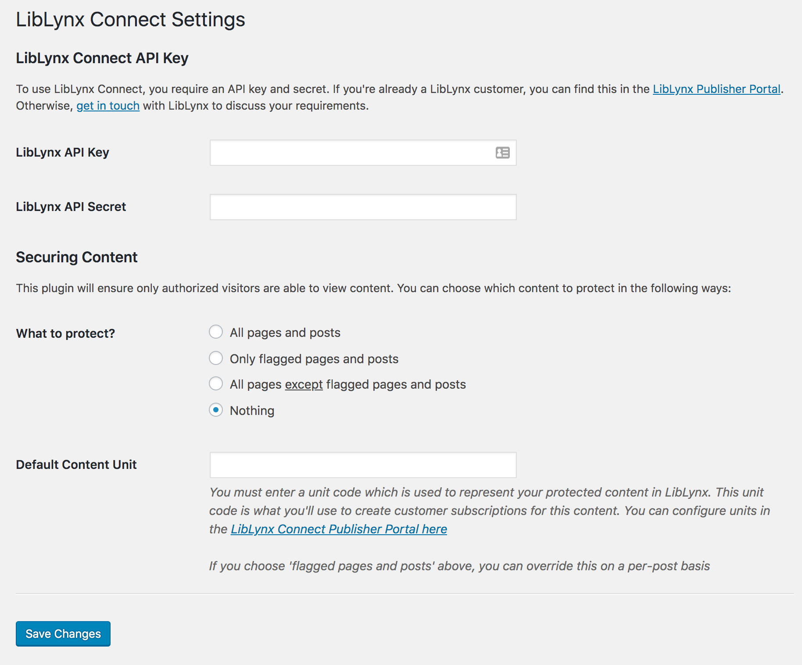
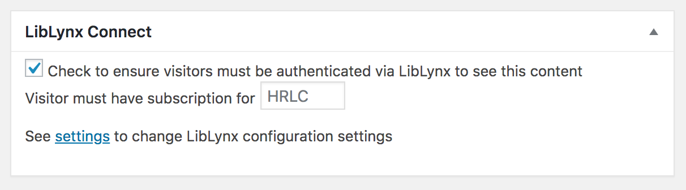

# LibLynx Wordpress Plugin

This is a simple integration of the [LibLynx](http://www.liblynx.com) access management API which allows posts or pages within
Wordpress to have their access controlled by LibLynx. 

This allows content to be easily protected by IP address, username/password, Shibboleth/SAML,
OpenID Connect, SIP2/library cards, and many other authentication mechanisms.

> To use this plugin, you require a LibLynx API key - contact [support@liblynx.com](mailto:support@liblynx.com) for assistance.

## Installation

Copy the contents of this repository into a subfolder of `wp-content/plugins`, e.g. 
`wp-content/plugins/liblynx-connect`

Activate the plugin inside the Wordpress Plugins listing

Once activated, you can access the settings.

## Configuration

To set up the global settings for the plugin, go to Settings->LibLynx Connect in the 
wordpress dashboard.

### Step 1 - set your API key

The first thing to setup is your LibLynx API key. This can be obtained from the 
LibLynx publisher portal. The API key is used by the plugin to identify itself
to LibLynx.

Contact support@liblynx.com if you don't have a LibLynx API key yet.

### Step 2 - choose protection method

The plugin offers a few methods of protecting content - choose the one that best fits your needs

* *All pages and posts* - all Wordpress pages and posts will require authentication. Use this if the site contains no freely available pages at all.
* *Only flagged pages and posts* - you can instead choose to mark specific posts and pages as requiring authentication. This is useful if you have a mixture of free and paid-for content.
* *Only pages except flagged one* - Similar to above, but useful in cases where a small number of pages are freely available.
* *Nothing* - all content will be freely available to all

Finally, you can use the default 'content unit' associated with content. A account in LibLynx has
subscriptions to one or more content units you define. These will typically have short codenames. Typically
you will use a single unit to represent all your Wordpress content, and this would be entered here.

For more complex integrations, you can override this on a per-page basis, allowing you divide
your content until separately saleable chunks.

## Post/Page options

Once activated, the plugin adds a new box to the bottom of the Wordpress page/post editor
where you can control whether or not the post will require LibLynx authentication.

The options presented in this box will depend on the global plugin settings. Pictured
above is an example of a page which has been explicitly flagged as requiring 
authentication, and the user would need a subscription to the `HRLC` content unit to
view it.

